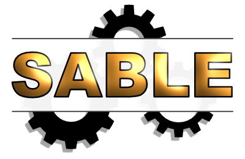

# SABLE



<p>


</p>

## Introduction

Scraping Assisted by Learning (SABLE) is a collection of tools for web crawling and web scraping.  Some elements involve supervised machine learning to classify text.  The idea is to discover potential new data sources on the web in Portable Document Format (PDF), apply a text classification model to predict whether the PDF contains useful data, and then scrape data using templates, text analysis, and other methods.  SABLE was initially developed to scrape data from government websites in support of the U.S. Census Bureau's Quarterly Summary of State & Local Tax Revenue (QTAX).  For more information about QTAX, including technical documentation and experimental monthly state tax collections, visit [https://www.census.gov/programs-surveys/qtax.html](https://www.census.gov/programs-surveys/qtax.html).

## Software

SABLE is based on the following open-source software:

* [Linux](https://www.linux.org/)
  * [wget](https://www.gnu.org/software/wget/)
  * [pdftotext](https://en.wikipedia.org/wiki/Poppler_(software))
  * [pdftoppm](https://en.wikipedia.org/wiki/Poppler_(software))

The Linux command-line utilities wget, pdftotext, and pdftoppm are used to download documents, convert PDFs to TXT format, and convert PDFs to image files, respectively.

* [Apache Nutch](http://nutch.apache.org/) (version 1.20)

Apache Nutch is a Java-based web crawler and is used to crawl websites, discover PDFs, and compile a training set of documents for model building.

* [Python](http://www.python.org/) (version 3.10)
  * [scikit-learn](http://www.scikit-learn.org/stable/)
  * [NLTK](https://www.nltk.org/) (Natural Language Toolkit)
  * [PDFMiner3K](https://github.com/jaepil/pdfminer3k/)
  * [Beautiful Soup](https://www.crummy.com/software/BeautifulSoup/bs4/doc/)
  * [pandas](https://pandas.pydata.org/)
  * [tabula](https://pypi.org/project/tabula-py/)
  * [Selenium](https://pypi.org/project/selenium/)

With the help of various packages, Python is used to download documents in special cases, scrape data and text from PDFs, and fit and evaluate text classification models.  These models are based on various supervised machine learning algorithms such as naive Bayes, logistic regression, and random forests.

* [Tesseract](https://tesseract-ocr.github.io/)

Tesseract is an optical character recognition (OCR) engine used to extract text from image-based PDFs.

## Python Programs

The following tables describe the Python programs in this repository.  More information can be found in the programs themsevles.  There are different series of programs for performing different web crawling, web scraping, and machine learning tasks.

### "S" Series for Discovering New Data Sources

This is the original series of SABLE programs used to discover potential new online data sources.  The Python program ```pdf2txt.py```, which is invoked by ```s2_convert.py```, comes with the PDFMiner3K module.  It is included here for completeness.  For the first-hand source of this program, please see [https://github.com/jaepil/pdfminer3k/blob/master/tools/pdf2txt.py](https://github.com/jaepil/pdfminer3k/blob/master/tools/pdf2txt.py).

| Program              | Purpose                                                    |
| -------------------- | ---------------------------------------------------------- |
| ```s0_setup.py```    | Set up project folders                                     |
| ```s1_download.py``` | Download PDFs discovered during web crawling               |
| ```s2_convert.py```  | Convert PDFs to TXT format                                 |
| ```s3_model.py```    | Fit and evaluate text classification models                |
| ```s4_logistic.py``` | Fit a logisitc regression model and apply it to new PDFs   |
| ```pdf2txt.py```     | Extract text from PDFs (created by developers of PDFMiner) |

### "M" Series for Scraping Tax Revenue Data

This series of Python programs is used to (1) download specific PDFs known to contain useful tax revenue data (mostly on a monthly basis), (2) scrape values and metadata from the downloaded PDFs, and (3) output the scraped data in an organized format.  This codebase was developed to scrape tax data in support of QTAX.  The programs ```m1_download.py``` and ```m2_scrape.py``` contain example code for a few state government websites.

| Program              | Purpose                                                            |
| -------------------- | ------------------------------------------------------------------ |
| ```m0_setup.py```    | Set up project folders                                             |
| ```m1_download.py``` | Download PDFs known to contain useful tax revenue data             |
| ```m2_scrape.py```   | Scrape data from downloaded PDFs using templates and text analysis |

## Lists of Stop Words

This repository also contains lists of common "stop" words for multiple languages such as French, German, and Spanish.  Stop words are useful in many natural language processing tasks.  These lists come from the NLTK package and serve as a good starting point for creating stop lists of your own.  Foreign accent marks have been removed from characters, and some lists have been modified slightly in other ways.

## Example Files and Output

An example training set for predicting whether a PDF contains data on tax revenue collections is located in the folders ```/neg_txt/``` and ```/pos_txt/```.  These TXT files were created by applying the PDF-to-TXT conversion program ```s2_convert.py``` to PDFs discovered on various websites.  The folder ```/pred_txt/``` contains TXT files that represent previously unseen documents to be classified by a logistic regression model.

| Folder           | Description                                                                   |
| ---------------- | ----------------------------------------------------------------------------- |
| ```/neg_txt/```  | Collection of TXT files belonging to the "negative" class in the training set |
| ```/pos_txt/```  | Collection of TXT files belonging to the "positive" class in the training set |
| ```/pred_txt/``` | Collection of TXT files that are to be classified by a model                  |

The following files are found in the ```/examples/``` folder.  The three PDFs and corresponding TXT files are examples of the PDF-to-TXT conversion program applied to publications from the Census Bureau website: [https://www.census.gov](https://www.census.gov).

| File                            | Description                                                                                |
| ------------------------------- | ------------------------------------------------------------------------------------------ |
| ```example_g12-cg-org.pdf```    | 2012 Census of Governments report                                                          |
| ```example_g12-cg-org.txt```    | Output from ```s2_convert.py``` applied to above PDF                                       |
| ```example_g16-aspp-sl.pdf```   | 2016 Annual Survey of Public Pensions report                                               |
| ```example_g16-aspp-sl.txt```   | Output from ```s2_convert.py``` applied to above PDF                                       |
| ```example_g17-qtax4.pdf```     | 2017q4 Quarterly Summary of State and Local Government Tax Revenue report                  |
| ```example_g17-qtax4.txt```     | Output from ```s2_convert.py``` applied to above PDF                                       |
| ```example_model_output.txt```  | Output from ```s3_model.py``` applied to training set                                      |
| ```example_pred_output.txt```   | Output from ```s4_logistic.py``` applied to training set and TXT files in ```/pred_txt/``` |
| ```example_scrape_output.txt``` | Output from ```m2_scrape.py``` applied to New Jersey for May 2019                          |
| ```example_seed.txt```          | Example seed URLs for crawling state government websites                                   |

## Organization of Files

The following organization of files and folders on a Linux/Unix system is assumed.

### "S" Series Folders and Python Programs

```
/s_project/crawl/
/s_project/download/
/s_project/dump/
/s_project/neg_pdf/
/s_project/neg_prob/
/s_project/neg_txt/
/s_project/neg_xml/
/s_project/pos_pdf/
/s_project/pos_prob/
/s_project/pos_txt/
/s_project/pos_xml/
/s_project/pred_pdf/
/s_project/pred_prob/
/s_project/pred_txt/
/s_project/pred_xml/
/s_project/urls/
/pdf2txt.py
/s0_setup.py
/s1_download.py
/s2_convert.py
/s3_model.py
/s4_logistic.py
```

### "M" Series Folders and Python Programs

```
/m_project/dat/
/m_project/pdf/
/m_project/prod/
/m_project/txt/
/m0_setup.py
/m1_download.py
/m2_scrape.py
```

### Lists of Stop Words

```
/stop_danish.txt
/stop_dutch.txt
/stop_english.txt
/stop_finnish.txt
/stop_french.txt
/stop_german.txt
/stop_hungarian.txt
/stop_italian.txt
/stop_norwegian.txt
/stop_portuguese.txt
/stop_spanish.txt
/stop_swedish.txt
/stop_turkish.txt
```

## Example Runs

The following are example runs of the "S" and "M" series of programs.

### Example "S" Series Run

Set up folders for an "S" series project called ```s_project```.

```
>> python3 s0_setup.py s_project
```

Create ```seed.txt```, which contains the seed URLs, or starting points, of the web crawl.  Run Apache Nutch and crawl to a specified depth (depth equals three in this example).  Output contents of the Apache Nutch database to CSV format.

```
#Enter seed URLs
>> vi /s_project/urls/seed.txt
#Crawl to a specified depth
>> crawl -s /s_project/urls/ /s_project/crawl/ 3
#Output contents of Apache Nutch database to CSV format
>> readdb /s_project/crawl/crawldb/ -dump /s_project/dump/ -format csv
>> cat /s_project/dump/part-r-00000 > /s_project/dump/dump.csv
```

Download PDFs discovered during the web crawl to the folder ```/s_project/download/```.  Manually classify the downloaded PDFs as "positive" (contains useful data) or "negative" and place them accordingly in the folders ```/s_project/pos_pdf/``` and ```/s_project/neg_pdf/```.

```
>> python3 s1_download.py s_project
```

Convert the PDFs in the positive class to TXT format.  Convert the PDFs in the negative class to TXT format.

```
>> python3 s2_convert.py s_project english pos
>> python3 s2_convert.py s_project english neg
```

Fit and evaluate various text classification models.

```
>> python3 s3_model.py s_project
```

Obtain new PDFs (for example, through continued web crawling) and place them in the folder ```/s_project/pred_pdf/```.  Convert these PDFs to TXT format.

```
>> python3 s2_convert.py s_project english pred
```

Fit a logistic regression model using the manually classified positive and negative PDFs and then use the fitted model to predict classes and probabilities for new PDFs.

```
>> python3 s4_logistic.py s_project
```

### Example "M" Series Run

Set up folders for an "M" series project called ```m_project```.

```
>> python3 m0_setup.py m_project
```

Iterate through a list of states and download PDFs containing tax revenue data for January 2020.

```
>> python3 m1_download.py m_project 2020 01
```

Scrape tax revenue data from the downloaded PDFs and organize the results in a TXT file.

```
>> python3 m2_scrape.py m_project 2020 01
```

## Contributors

The following people have contributed to SABLE's codebase:

* Brian Dumbacher ([@brian-dumbacher](https://www.github.com/brian-dumbacher))
* Hector Ferronato
* Alan Weisel
* Eric Valentine

## References

The ```/references/``` folder contains the following conference papers and presentations:

* Ferronato, H. and Dumbacher, B. (2022). <b>Web Scraping in Support of the U.S. Census Bureau's Public Sector Programs</b>. <i>Proceedings of the 2022 Federal Committee on Statistical Methodology (FCSM) Research and Policy Conference</i>. Washington, DC: Federal Committee on Statistical Methodology.
* Dumbacher, B. and Diamond, L.K. (2018). <b>SABLE: Tools for Web Crawling, Web Scraping, and Text Classification</b>. <i>Proceedings of the 2018 Federal Committee on Statistical Methodology (FCSM) Research Conference</i>. Washington, DC: Federal Committee on Statistical Methodology.
* Dumbacher, B. and Hanna, D. (2017). <b>Using Passive Data Collection, System-to-System Data Collection, and Machine Learning to Improve Economic Surveys</b>. <i>2017 Proceedings of the American Statistical Association, Business and Economic Statistics Section</i>. Alexandria, VA: American Statistical Association, 772-785.
* Dumbacher, B. and Capps, C. (2016). <b>Big Data Methods for Scraping Government Tax Revenue from the Web</b>. <i>2016 Proceedings of the American Statistical Association, Section on Statistical Learning and Data Science</i>. Alexandria, VA: American Statistical Association, 2940-2954.
